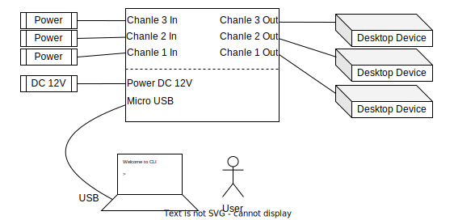

# Auto Power Switch User Manual

## 1. Introduction

Auto Power Switch is a power sequencer controlled by the command line based on serial port.
The current version supports 3-channals.
Due to the use of small relays, it supports isolated low voltage and low current switching control.
The controlled voltage is usually less than 30V and the current is less than 2A.
It can meet the power timing control of small desktop devices, such as Router, Set-top box or small Switch, etc.

Auto Power Switch supports both manual and automatic control.
You can enter power on or off commands to open or close ports, or bind profiles to ports for automatic execution.
The instructions supported by the profile contain `on`, `off`, `delay`, `goto`, `condition`, and `integer calculation`, etc.
It also supports the saving of profiles, making it easy to continue using them next time.

A typical usage example is shown in the following figure.



## 2. Command Line Manual

### 2.1 Convention

| Symbol  | Meaning |
| ------- | ------- |
| \<...\> | This is a mandatory field |
| [...]   | This is a optional field  |
| \|      | Indicates either one out of two or one out of many |
| all     | For all |
| command | Main command word |
| number  | An integer number |
| string  | A string |
|

### 2.2 Command Line Interface

| Command                                             | Meaning |
| ---                                                 | --- |
| help [config \| port \| profile]                    | `help` root command or help for specific commands |
| config show                                         | Display current configuration |
| config save                                         | Save current configuration to NVRAM |
| config clear \<all \| current \| saved\>            | Clear all / current / saved configuration |
| port [port number] on                               | Open the specified port or all ports |
| port [port number] off                              | Close the specified port or all ports |
| port [port number] bind-profile \<profile name\>    | Bind a specified profile to a port or all ports |
| port [port number] unbind-profile                   | Unbind port or all ports profile |
| port [port number] active                           | Port needs to be activated after binding the profile |
| port [port number] status                           | Display the ports current status |
| profile create \<name\> [max line number]           | Create a profile with a specified name and specify the maximum line number. If max number is omitted, max number defaults to 20 |
| profile show [name]                                 | Display profile content |
| profile delete \<name\>                             | Delete a profile with a specified name |
| profile clear \<name\> \<all \| line number\>       | Delete a specified line or all lines of a specified profile |
| profile modify \<name\> \<line number\> \<string\>  | Modify a specified line of a specified profile |
| profile check \<name>                               | Check if the profile is legal |
| profile save [name]                                 | Save a specified profile or all profiles to NVRAM |
|

### 2.3 Examples

**Example 1: Open all ports manually**
```
> port on
```

**Example 2: Close all ports manually**
```
> port off
```

**Example 3: Open port 1 manually**
```
> port 1 on
```

**Example 4: Display port status**
```
> port status
```

**Example 5: Create a profile called '`twinkle`' for port cycle on and off**
```
> profile create twinkle
> profile modify twinkle 1 "on"
> profile modify twinkle 2 "wait 500"
> profile modify twinkle 3 "off"
> profile modify twinkle 4 "wait 500"
> profile modify twinkle 5 "goto 1"
> profile check twinkle
> profile save twinkle
```
**Example 6: Show profile '`twinkle`' content'**
```
> profile show twinkle
```

**Example 7: All ports bind profile named '`twinkle`' and active**
```
> port bind-profile twinkle
> port active
```

## 3. Profile Design

### 3.1 What is profile

### 3.2 Supported Command Word

### 3.3 Examples

## 4. Extension
